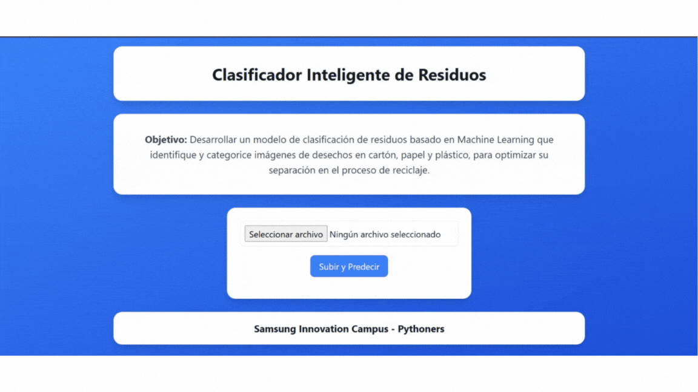
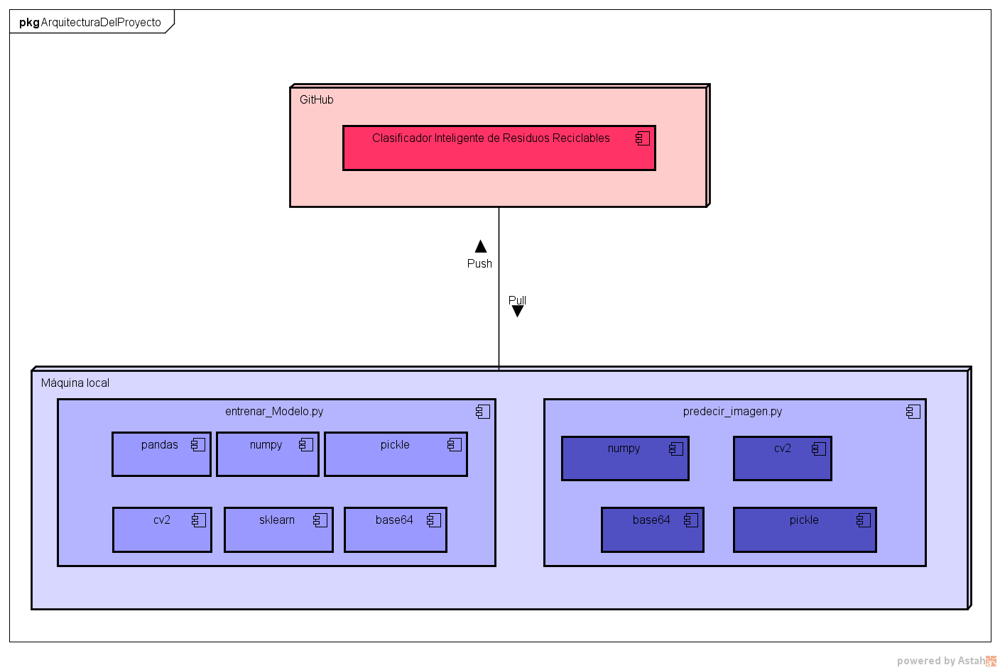
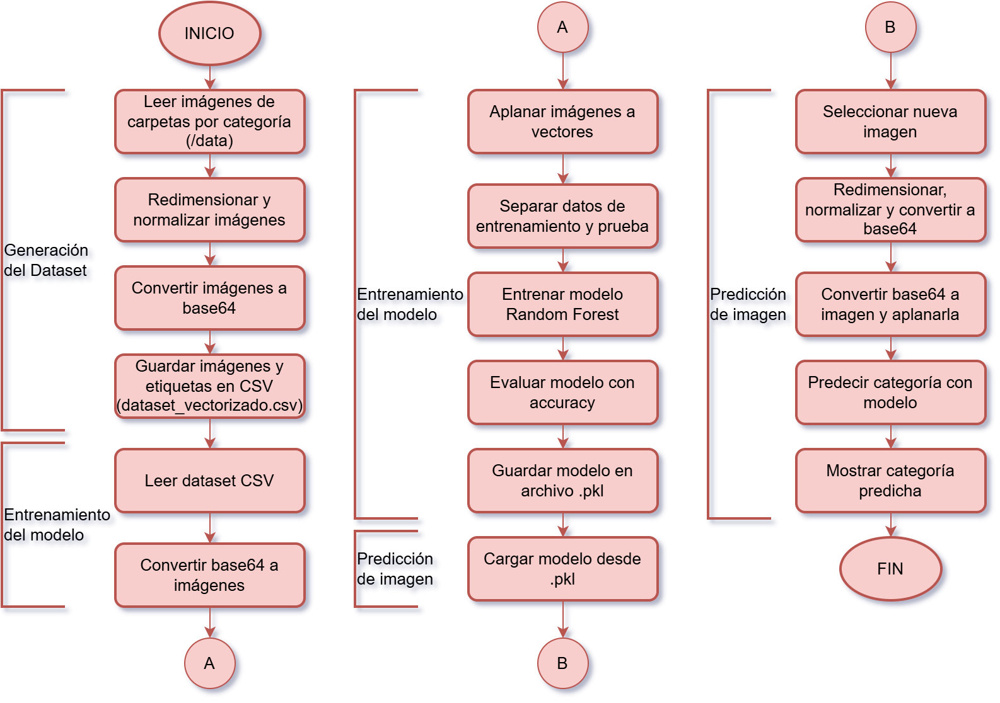
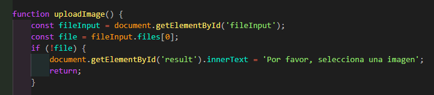
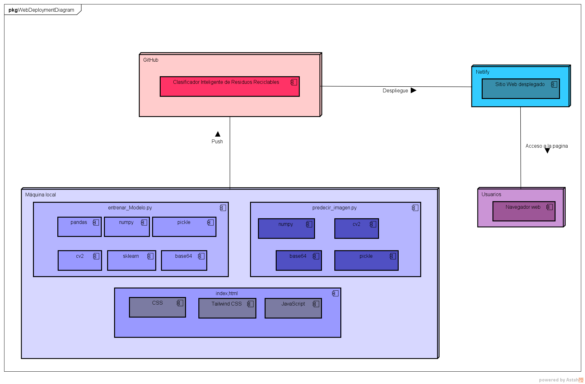

# Clasificador Inteligente de Residuos Reciclables

Este proyecto consiste en el desarrollo de un modelo de clasificación de residuos utilizando técnicas de Machine Learning. Se implementará un modelo basado en Random Forest para clasificar imágenes de residuos en tres categorías principales: cartón, papel y plástico. El objetivo es facilitar la separación de residuos reciclables mediante un sistema automatizado que pueda ser aplicado en aplicaciones web. Para el entrenamiento del modelo, se utilizará un dataset de imágenes de residuos previamente etiquetadas.

## Tabla de contenidos

1. [Nombre](#Nombre)
2. [Descripción](#Descripción)
3. [Arquitectura](#Arquitectura)
4. [Proceso](#Proceso)
5. [Funcionalidades](#Funcionalidades)
6. [Estado del proyecto](#EstadoDelProyecto)
7. [Agradecimientos](#Agradecimientos)

### Nombre
* Clasificador Inteligente de Residuos Reciclables

### Descripción
Este proyecto consiste en el desarrollo de un modelo de clasificación de residuos utilizando técnicas de Machine Learning. Se implementará un modelo basado en Random Forest para clasificar imágenes de residuos en tres categorías principales: cartón, papel y plástico. El objetivo es facilitar la separación de residuos reciclables mediante un sistema automatizado que pueda ser aplicado en aplicaciones web. Para el entrenamiento del modelo, se utilizará un dataset de imágenes de residuos previamente etiquetadas.

### Arquitectura
- La arquitectura del proyecto se puede visualizar a través del siguiente diagrama de despliegue: - (Pendiente)
    

- El funcionamiento del proyecto se puede visualizar a través del siguiente diagrama de flujo: - (Pendiente)
    

### Proceso

* **Fuente del dataset:** https://huggingface.co/datasets/garythung/trashnet

* **Limpieza de datos:**
    

* **Manejo excepciones / control errores:**  No se permite hacer la predicción mientras no se suba una imagen, aunque se le dé clic en el botón. El código para esto es:
    

* **Estadísticos (Valores, gráficos, …):** - (Pendiente)

### Funcionalidades

- **Integración del proyecto en una página web**
    - Enlace a la página web: ***No pudimos desplegarlo, pero se puede ejecutar el sitio web en local.***
    - Tecnología/Herramientas usadas: HTML, CSS, Tailwind, Flask.
    - Arquitectura (img): La arquitectura del proyecto junto con la integración en una página web se puede visualizar a través del siguiente diagrama de despliegue.
    

### EstadoDelProyecto
En proceso de desarrollo

### Agradecimientos
Como equipo Pythoners expresamos nuestros más sinceros agradecimientos a la profesora Jenny Remolina y al profesor Jeancarlos, también a los tutores por su disposición de enseñarnos y siempre tratar de no dejarnos con ninguna duda, gracias por todos sus conocimientos compartidos durante el curso de Python e Inteligencia Artificial, brindado por Samsung Innovation Campus (SIC) a través de FUNDESTEAM. Además, agradecemos a la coordinadora Meydibeth Monsalve por su consideración y apoyo durante el desarrollo de todo el curso. Y por último, pero no menos importante, agradecemos a todo el equipo de apoyo de SIC, quienes hicieron lo posible por apoyarnos y dar respuesta a todas nuestras preguntas.